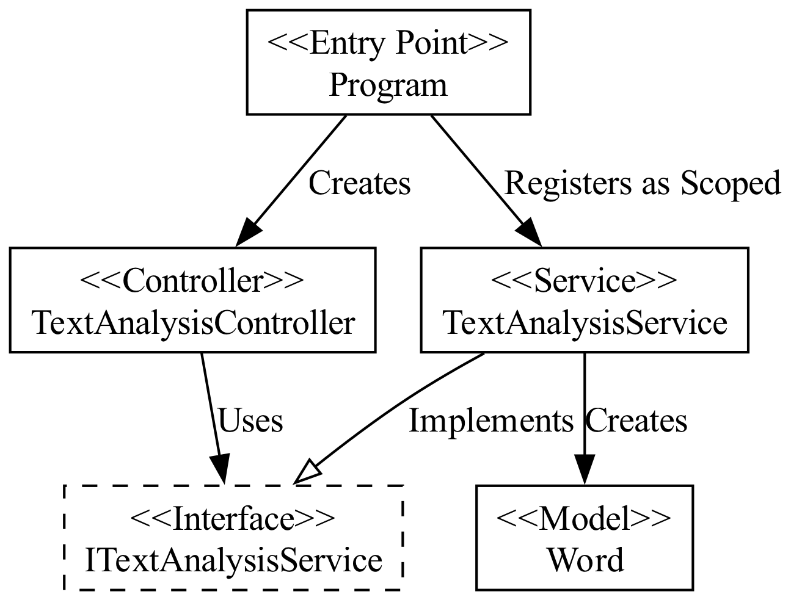
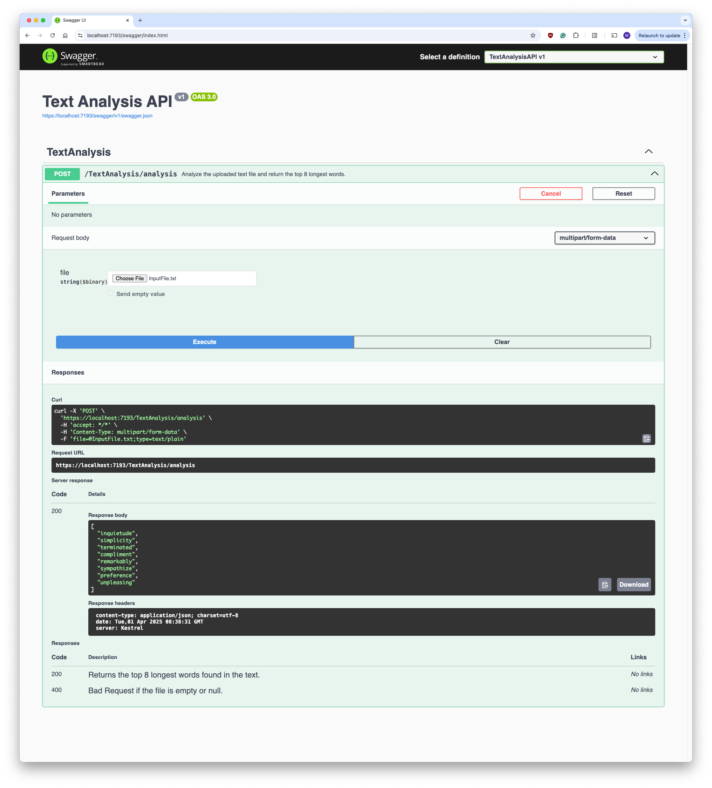

# Text Analysis API

## Overview

The Text Analysis API is a web API implemented in C# using ASP.NET Core. It accepts a text file via a POST request and returns the top 8 longest words found in the file. The API processes the text by normalizing words and removing punctuation marks to ensure no duplicates are returned. API documentation is generated with Swagger.

I developed this project as part of a technical assessment during an interview process. I was tasked with building an API that analyzes a given text file using a programming language of my choice to showcase my object-oriented design and API development skills.

## Features

- **File Upload:** Accepts a text file via a POST request.
- **Longest Words Extraction:** Returns the top 8 longest words in the provided text.
- **Data Cleaning:** Removes duplicate words and punctuation marks.
- **Swagger Integration:** Provides API documentation and testing capabilities.

## Prerequisites

- .NET 8.0
- A self-signed certificate to enable HTTPS.
- An API client or Swagger UI (included with the project).

## Setup and Running the API

Build and Run the Project

```bash
dotnet build
dotnet run
```

## Architecture

<div align="center">
  
</div>

## Swagger UI

<div align="center">
  
</div>
